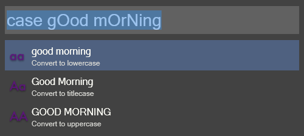

# Wox.Plugin.CaseConverter
Wox Plugin written in python to convert text to lowercase, uppercase, titlecase

## Usage

Enter the keyword `case` followed by the text that you want to convert. All three styles are previewed as Wox results. Select one to copy it to the clipboard.
